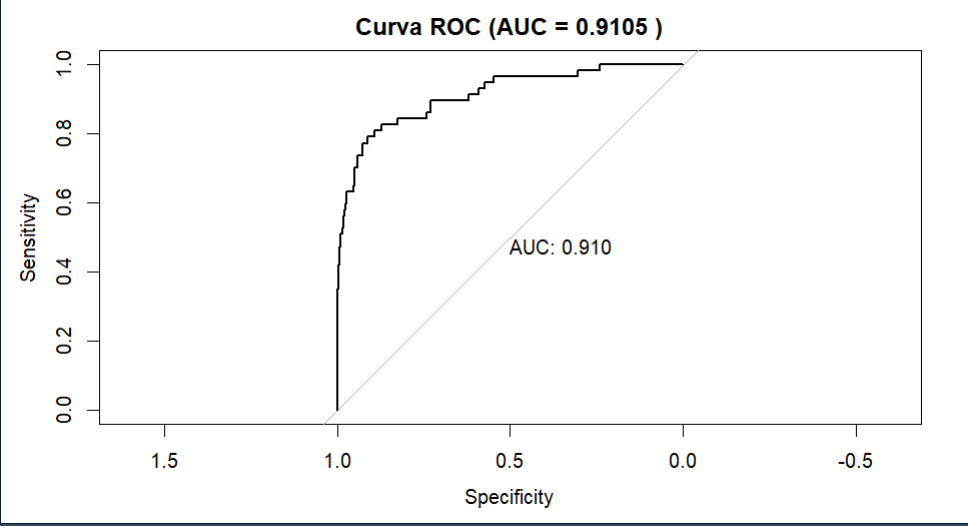
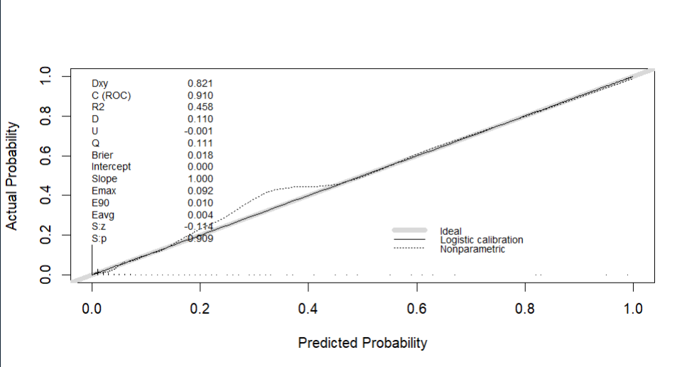
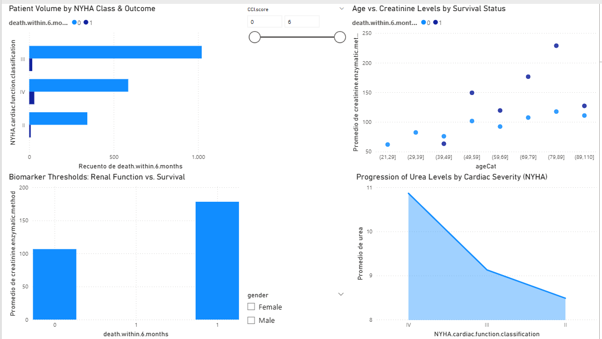
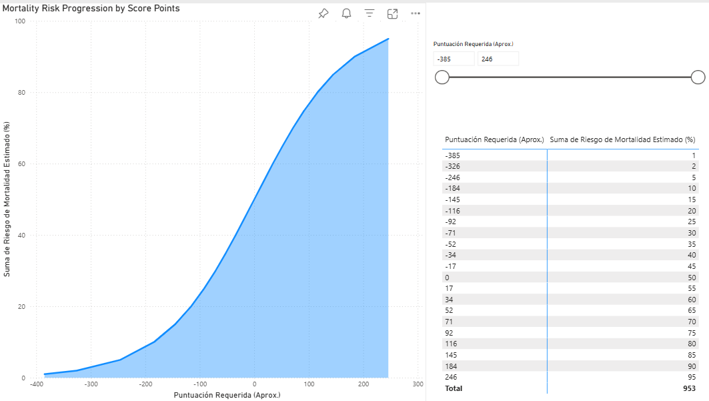

# Development and Validation of Prognostic Scores in Logistic Regression 📊🏥

This repository contains the full technical implementation, statistical analysis, and dissertation for my Master's Thesis in **Advanced Multivariate Data Analysis and Big Data** at the **University of Salamanca (USAL)**.

## 🎯 Project Overview
The research focuses on the clinical development and statistical validation of prognostic scores. By leveraging real-world electronic health records, the project transforms complex logistic regression models into practical clinical tools.

## 📊 Data Source
The analysis is conducted using the **"Heart Failure Prediction from Clinical and Laboratory Data in Zigong"** dataset, hosted on **PhysioNet** (Gu et al., 2022).
* **Population**: 2,000+ patients with heart failure.
* **Target**: Predicting 6-month mortality (`death.within.6.months`).

## 🛠️ Technical Stack & Methodology
* **Statistical Computing**: **R** (Data cleaning, MICE imputation, LASSO, Random Forest, and Model Validation).
* **Document Engineering**: Full dissertation authored in **LaTeX** to ensure rigorous mathematical formatting and structured documentation.
* **Presentations**: Technical defense developed using the **LaTeX/Beamer** class for high-quality scientific communication.
* **Standards**: Following **TRIPOD** guidelines for transparent reporting of multivariable prediction models.

## 📂 Repository Structure

* 📁 **`analysis/`**: 
    * `Prognostic_Model_Pipeline.R`: End-to-end R script including data preprocessing, feature selection, and model calibration.
* 📁 **`dashboards/`**:
    * `bi_dashboard.pbix`: Exploratory Data Analysis (EDA) dashboard for population clinical insights.
    * `bi_scores.pbix`: Clinical Decision Support Tool based on the developed scoring system.
* 📁 **`data/`**: 
    * `heart_failure_zigong_data.csv`: Clinical dataset from PhysioNet used for the study.
* 📁 **`docs/`**: 
    * `Master_Thesis.pdf`: Complete written dissertation in Spanish (LaTeX-generated).
    * `Thesis_Defense_Beamer.pdf`: Summary presentation slides in Spanish (Beamer-generated).
* 📁 **`graphics/`**:
    * `roc_curve.png`: Visual representation of model discrimination (AUC).
    * `calibration_graphic.png`: Assessment of agreement between predicted and observed probabilities.
* 📄 **`LICENSE`**: MIT License.

## 🚀 Key Insights
1.  **Missing Data**: Successfully handled missing clinical values using **MICE** (Multivariate Imputation by Chained Equations) to preserve statistical power.
2.  **Predictive Accuracy**: The final model demonstrates robust **Discrimination (AUC)** and **Calibration (Hosmer-Lemeshow)**, effectively predicting 6-month mortality risk.
3.  **Clinical Translation**: Logistic coefficients were scaled into an integer-based **Score**, making the model ready for real-world clinical use.
## 🖼️ Visual Insights & Model Validation

This section showcases the core graphical outputs of the project, highlighting both the descriptive clinical data and the rigorous statistical validation of the predictive model.

### 📈 Statistical Performance (Model Accuracy)
To ensure medical reliability, the model was subjected to a dual-validation process:

* **ROC Curve Analysis**: Used to evaluate the model's discriminative ability. The **AUC (Area Under the Curve)** demonstrates high precision in distinguishing between survival outcomes.
* **Calibration Plot**: This graph confirms the agreement between the predicted probabilities and the actual observed mortality, ensuring the score remains reliable across all risk deciles.

| ROC Curve | Calibration Plot |
| :---: | :---: |
|  |  |

### 📊 Interactive Dashboards (Business Intelligence)
The following interfaces were designed to translate mathematical complexity into intuitive clinical decision-making tools:

* **Clinical Cohort Explorer**: A comprehensive view of the 2,008-patient dataset, featuring biomarker stratification (Creatinine/Urea), NYHA functional class distribution, and etiology treemaps.
* **HF-Scorecard & Risk Calculator**: An operational tool that allows clinicians to input patient data and instantly receive a quantitative 180-day mortality risk percentage.

| Clinical Overview | Risk Scorecard |
| :---: | :---: |
|  |  |

> **Note**: For a full interactive experience, please refer to the `.pbix` files located in the `/dashboards` directory.
---
*Developed by Antonio Luque Ruiz - University of Salamanca.*
